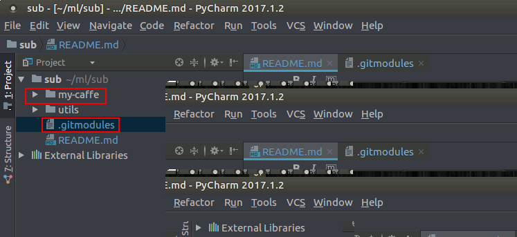
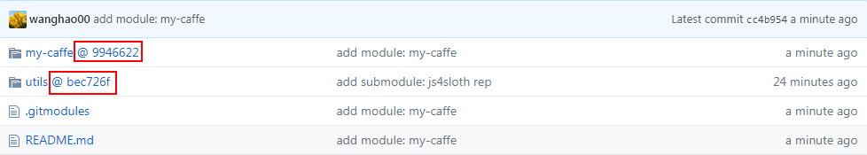

这是说明文件

在测试 submodule 功能

这是一个由配置运行py-faster-rcnn项目而引申出来的思考.

#### 下载的工程带有submodule
当下载下来的工程带有submodule时, 初始的时候, 如果直接使用`git clone url`, submodule的内容并不会自动下载下来; 此时需要额外执行：
```
git submodule update --init --recursive
```
或者, 直接使用这种命令格式
```
# Make sure to clone with --recursive
git clone --recursive url
```

#### 创建/添加 submodule 
我在尝试 包含 自己的 js4sloth 项目
```
# 命令格式
# git submodule add 仓库地址 路径(会显示为当前项目下的一个目录)
git submodule add https://github.com/wanghao00/js4sloth.git utils
```

命令执行完毕后,在当前项目目录下生成了`utils`目录 和 `.gitmodules`文件, 文件内容如下：
```
[submodule "utils"]
	path = utils
	url = https://github.com/wanghao00/js4sloth.git
```

#### submodule的branch切换, 和 删除

分支切换

```
# 创建
git submodule add https://github.com/wanghao00/caffe.git my-caffe
```
此时,包含了2个 submodule, `.gitmodules`文件内容如下：
```
[submodule "utils"]
	path = utils
	url = https://github.com/wanghao00/js4sloth.git
[submodule "my-caffe"]
	path = my-caffe
	url = https://github.com/wanghao00/caffe.git
```
项目的目录结构如图：



下面尝试切换my-caffe submodule的分支

切换目录到 my-caffe,和正常切换分支一样,使用命令
``` 
# 列出 所有分支名
git branch 
git checkout 分支名

# 一步到位,直接下载指定分支
git clone -b 分支名 url
```

#### submodule的删除

删除操作分为几个步骤：
1. 删除在`.gitmodules`文件中的相应配置信息。
2. 执行`git rm -cached` 将子模块所在的文件删除


参考：
* [git submodule的使用](http://blog.csdn.net/wangjia55/article/details/24400501)
* [请问如何更新git项目中的submodule](https://segmentfault.com/q/1010000002538609)
* [Github的项目怎么引用另一个项目？](https://segmentfault.com/q/1010000000670427)
* [github中, fork了别人项目后, 如何将别人新增的分支同步过来](https://segmentfault.com/q/1010000004228020/)